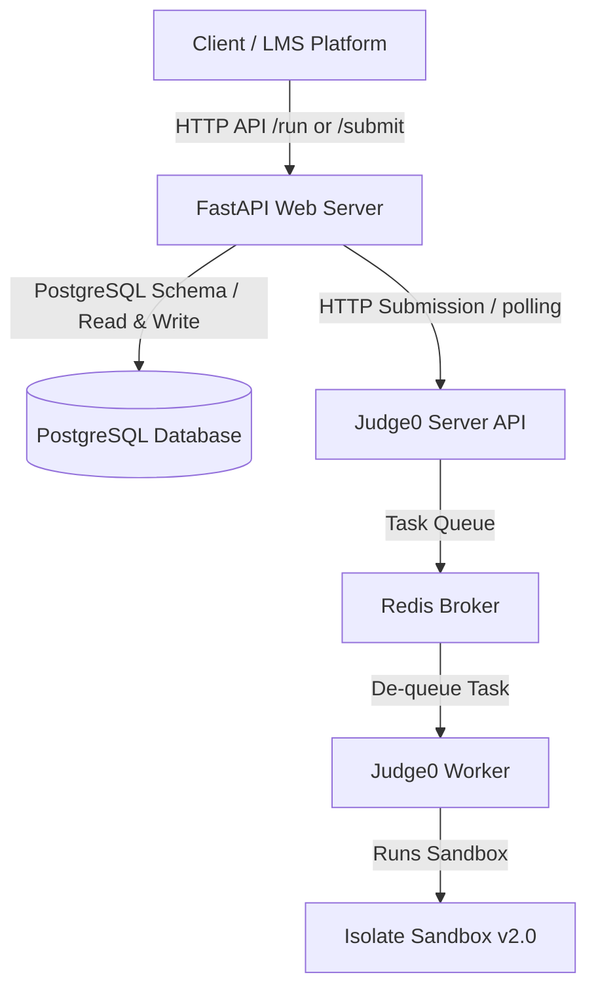

# Coding Assessment Execution Service (LeetCode/HackerRank clone backend)

A production-ready Coding Assessment Execution Service utilizing **FastAPI**, **PostgreSQL**, **SQLAlchemy**, and a real **Judge0 CE** instance running locally via Docker on Windows (WSL2).

---

## Project Architecture



- **`backend-web` (FastAPI):** Exposes routes for executing code runs, submission runs, questions management, and test case management.
- **`backend-db` (Postgres):** Persists questions, test cases, and runs/submission history.
- **`judge0-server`:** Standard Judge0 API endpoint for queueing and managing code execution submissions.
- **`judge0-worker`:** Processes compiles and execution sandboxes.
- **`judge0-redis`:** Queue broker for the worker.
- **`judge0-db`:** Database for storing Judge0 tokens and configurations.

---

## WSL2 & Cgroups v2 Virtualization Fix

### 1. The Challenge
WSL2 and modern Docker Desktop operate on **cgroups v2** (unified hierarchy). However, older versions of Judge0's underlying sandbox engine (`isolate` v1.8.1) strictly require **cgroups v1** (separate hierarchies like `/sys/fs/cgroup/memory`). 
If cgroups v1 is unavailable:
- Running `isolate` in non-cgroups mode forces a process limit of **exactly 1** (`RLIMIT_NPROC=1`).
- This causes C++ compilers (`g++`) to crash with `Resource temporarily unavailable` (since compiling forks child processes).
- This causes Java programs (`java`) to crash with `OutOfMemoryError: unable to create new native thread` (since the JVM requires multiple startup threads).

### 2. The Solution
We successfully patched the environment to run under **cgroup v2** with full sandboxing capabilities:
1. **Upgraded Isolate:** We compiled `isolate` **v2.0** (which supports cgroups v2 natively) from source inside the worker container and replaced `/usr/local/bin/isolate`.
2. **Created Custom Config:** Configured `/usr/local/etc/isolate` to use `cg_root = /sys/fs/cgroup` and `lock_root = /run/isolate/locks`.
3. **Bypassed the "No Internal Processes" Constraint:** In cgroups v2, a parent group cannot have children if it contains processes. Inside Docker, all container processes reside in the root (`/sys/fs/cgroup`). We automated a startup wrapper command in `docker-compose.yml` that:
   - Creates a sub-cgroup `/sys/fs/cgroup/init`.
   - Moves all container processes to `/sys/fs/cgroup/init/cgroup.procs`.
   - Enables subtree controllers (`+cpu +memory +pids +cpuset`) on the root, allowing `isolate` to safely create sub-cgroup sandboxes (`/sys/fs/cgroup/box-<ID>`) with full resource limits.
4. **Re-enabled cgroups in Judge0:** Modified Judge0's `isolate_job.rb` to run with `@cgroups = "--cg"` and removed deprecated flags (`--cg-timing`) not present in cgroup v2.

---

## API Endpoints Reference

### Questions
- **`GET /questions`**: List all assessment questions.
- **`POST /questions`**: Create a new coding question.

### Test Cases
- **`GET /questions/{question_id}/testcases`**: Get test cases for a question.
- **`POST /questions/{question_id}/testcases`**: Create a test case.

### Runs & Submissions
- **`POST /run`**: Run ad-hoc code against custom input.
- **`POST /submit`**: Submit code to be evaluated against all test cases of a question.

---

## Web Frontend Interface

A premium, dark-mode Web IDE is served directly at the root of the FastAPI server:
- **URL**: `http://localhost:8000/`
- **Features**: Interactive problem selector (populated from the questions database), language switching (Python 3, C++ 17, Java 11), Monaco Editor (VS Code core) code editing, custom stdin input area, live compile/run results (stdout, stderr, execution time, memory usage), and submission verification against hidden test cases.

---

## Getting Started

### 1. Start Services
Ensure Docker Desktop is running. Start the Judge0 services and the backend application:

```powershell
# Navigate to judge0 directory and run compose
cd K:\lmes_portal\judge0
docker compose up -d

# Navigate to backend directory and run compose
cd K:\lmes_portal\backend
docker compose up -d --build
```

### 2. Auto-Configuration of Cgroups
The worker container is configured to run as `user: root` and will automatically configure the cgroup v2 controllers on startup.
To install the custom `isolate` v2.0 compiler inside the container, we execute the automated install script:

```powershell
# Copy install script to worker container
docker cp C:\Users\hariv\.gemini\antigravity-cli\brain\761e8575-1bdf-4d3e-957c-a16fc85f824f\scratch\install_isolate.sh judge0-worker-1:/tmp/install_isolate.sh

# Run install script
docker exec --user root judge0-worker-1 bash /tmp/install_isolate.sh
```

---

## Running Automated Tests

Run the complete test suite inside the FastAPI container:

```powershell
# Run backend unit tests and integration tests
docker exec -e PYTHONPATH=/workspace backend-web-1 pytest
```

To run only the Judge0 sandbox integration test (testing Python, C++, and Java execution against the real sandbox):

```powershell
docker exec -e JUDGE0_URL=http://host.docker.internal:2358 backend-web-1 python app/tests/test_judge0_integration.py
```

---

## Developer & Integration Guides

*   **Adding Questions & Templates:** See [QUESTIONS_GUIDE.md](file:///K:/lmes_portal/QUESTIONS_GUIDE.md) for step-by-step instructions on creating questions, constructing boilerplate templates, and seeding test cases.
*   **Lightweight Judge0 Deployment:** See [LIGHTWEIGHT_DEPLOYMENT.md](file:///K:/lmes_portal/judge0/LIGHTWEIGHT_DEPLOYMENT.md) to build a custom compilers image and reduce Judge0's size from 15GB to 1.2GB (supporting only Python & Java).
*   **Production Deployment Playbook:** See [DEPLOYMENT.md](file:///K:/lmes_portal/DEPLOYMENT.md) for network setups, single-server/multi-server configurations, and private cloud deployment checklists.
*   **Backend Integration Playbook:** See [INTEGRATION_GUIDE.md](file:///K:/lmes_portal/INTEGRATION_GUIDE.md) for details on extending the backend, adding new languages, batching requests, or linking with LMS platforms.
*   **AI Agent Context Handoff:** For AI coding agents needing to restore system context, history, and configuration states, see [PROJECT_CONTEXT.md](file:///K:/lmes_portal/PROJECT_CONTEXT.md).


