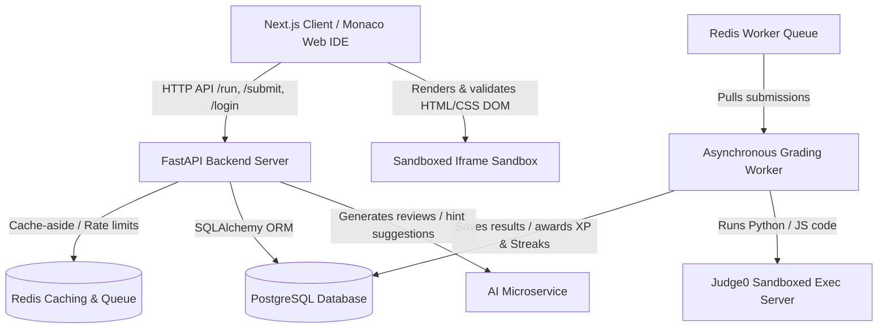

# DevArena AI-Powered Coding Practice Platform

DevArena is a highly optimized, production-ready coding practice and evaluation platform. It utilizes a **FastAPI** backend API, **PostgreSQL** database, **Redis** enqueuing system, a customized lightweight **Judge0 CE** execution sandbox, and a separate microservice-based **AI Service** for code reviews and progressive suggestions.

Designed to run efficiently on small virtual private servers (2 vCPUs, 4 GB RAM), the stack has been optimized from over 15 GB down to less than 1.2 GB by stripping out unused compiler runtimes and shifting static web evaluations (HTML/CSS) to client-side sandboxed frames.

---

## Unified Project Architecture



### Services Overview
1. **`backend-api` (FastAPI):** Orchestrates API routes, manages DB transactions, handles cache-aside mechanisms, exposes rate limiters, and runs the background worker thread.
2. **`ai-service` (FastAPI):** Specialized microservice that generates code quality reviews and progressive hints.
3. **`db` (Postgres 16):** Holds normalized relational data for questions, starter templates, tags, test cases, solutions, attempts, daily streaks, leaderboards, and badges.
4. **`redis` (Redis 7):** Serves as the global cache, API rate limiter, and FIFO queue broker.
5. **`server` / `worker` (Judge0 CE):** Executes user submissions under highly secure, cgroups v2-isolated runtimes (`isolate` sandbox v2.0).

---

## Features & Optimizations

### 1. Stripped Compiler Runtimes
To run on cost-effective VPS nodes, the Judge0 compiler base image was refactored in [Dockerfile.compilers](file:///K:/lmes_portal/judge0/Dockerfile.compilers) to completely remove Java, Rust, Go, C++, PHP, Kotlin, Ruby, and 50+ other heavy runtimes. Only **Python 3** and **Node.js** execution pathways are preserved.

### 2. Client-Side Web Sandbox (Task 7)
Web questions (HTML/CSS) bypass Judge0 servers entirely to save resources. They render inside a secure `iframe` with `sandbox="allow-scripts"` and undergo automated DOM and Tailwind CSS class check validation:
* **Required Elements:** Verifies existence of required components (e.g. `button#submit-btn`).
* **Required CSS Styling:** Validates layout configurations (e.g. `bg-blue-600`, `text-white`, `px-4`, `py-2`, `rounded`).
* **JavaScript Functionality:** Simulates click actions or script execution.

### 3. Redis Queue & Caching (Task 3)
* **Asynchronous Submissions:** When a user submits code, it is enqueued into Redis and processed out-of-band by a background daemon. Users poll the endpoint for instant updates.
* **Cache-aside Layer:** Public questions, test cases, and leaderboard rosters are cached in Redis. Writes instantly invalidate caches to prevent stale reads.
* **API Rate Limiting:** Prevent brute-forcing of `/run`, `/submit`, and `/login` using sliding-window rate limits.

### 4. Progressive AI Learning System (Task 8)
* **Attempt-based Hints:** Suggests progressive hints (Stage 1: Small hint, Stage 2: Detailed hint, Stage 3: Approach) before unlocking the verified solutions and O-notation complexity information on attempt 4.
* **AI Code Reviews:** Triggers service-to-service calls to `ai-service` to review code efficiency, identify bugs, and recommend refactoring.

---

## Getting Started (Local Run)

### 1. Start the Unified Compose Stack
Spin up the entire decoupled microservices stack (the custom multi-stage compilation for the Judge0 worker is built automatically on the first boot):
```bash
docker compose up --build -d
```

### 2. Seed Database Structures
Seed the PostgreSQL schemas with initial database structures (Languages, Databases/DS Topics, SQL/Python Questions, Test cases, Hints, and Solutions):
```bash
docker compose exec backend-api python -m app.seed.seed_data
```

### 3. (Optional) Local Development & Host Venv Setup
To run scripts, debuggers, or execute unit tests locally outside Docker, set up the Python virtual environment:
```bash
# Navigate to the backend folder
cd backend

# Create the virtual environment
python -m venv venv

# Activate the virtual environment
# On Windows (PowerShell):
.\venv\Scripts\Activate.ps1
# On Linux/macOS/WSL2:
source venv/bin/activate

# Install dependencies
pip install -r requirements.txt
```

### 4. Open the Web IDE
Access the Monaco Editor-based single-page workspace:
* **URL:** [http://localhost:8008/](http://localhost:8008/)

---

## API References

### Authentication (Rate Limited)
* `POST /login` - Student/Admin login authentication.

### Questions & Problems
* `GET /questions` - Retrieve cached list of all questions.
* `POST /questions` - (Admin) Create a question.
* `DELETE /questions/{id}` - (Admin) Delete a question.
* `POST /questions/{id}/duplicate` - (Admin) Duplicate an existing question.

### Test Cases
* `GET /questions/{id}/testcases` - Retrieve test cases for a question.
* `POST /questions/{id}/testcases` - (Admin) Create a test case.

### Execution & Submissions
* `POST /run` - Run code against custom stdin input.
* `POST /submit` - Enqueue submission for full evaluation.
* `GET /submissions/{id}` - Poll submission grading state.

### Gamification & Learning
* `GET /leaderboard` - Fetch top developers ranked by XP (cached).
* `GET /questions/{id}/stage` - Fetch next progressive AI hint stage.
* `POST /attempts/{attempt_id}/feedback` - Get AI Code review feedback.

---

## Running Automated Tests

To execute the unit test suite inside the FastAPI container:
```bash
docker compose exec backend-api pytest
```
