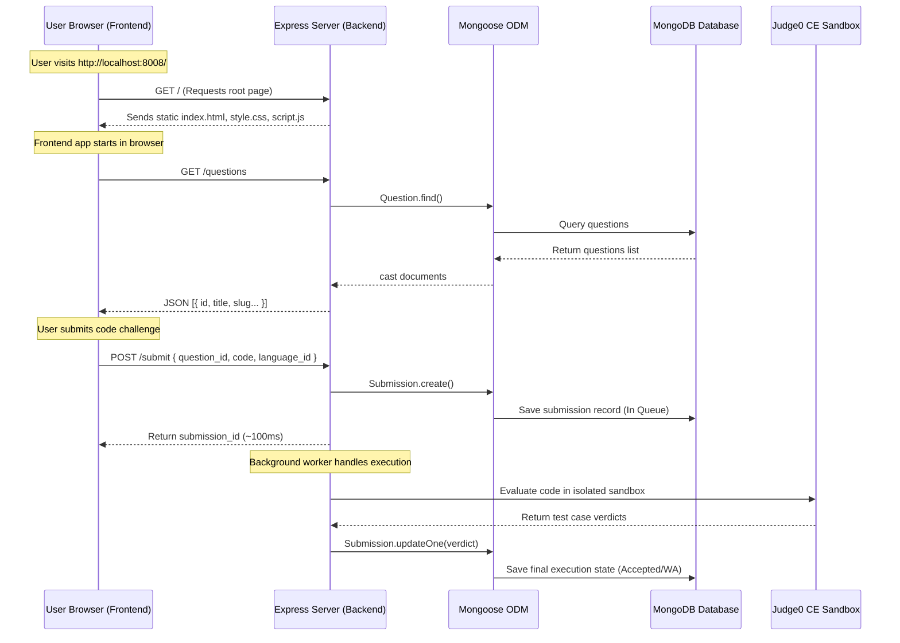

# 📖 LMES DevArena: System Explanation & Architecture Guide

This document provides a comprehensive breakdown of the LMES DevArena architecture, explaining how Docker containerization works, the communication flows between the Frontend and Backend, the rationale for migrating to Mongoose, and instructions on starting the services.

---

## 🐳 1. Docker Containerization & Database Seeding

The platform utilizes a containerized architecture to isolate the application environment, database engines, and code execution sandboxes.

### Command 1: `docker compose up -d --build`
This command orchestrates and starts the multi-container stack defined in `docker-compose.yml`:
* **`--build`**: Directs Docker Compose to build or rebuild images before starting containers. Specifically, it builds the `backend-api` container utilizing [backend/Dockerfile](file:///K:/lmes_portal/backend/Dockerfile).
* **`up`**: Instantiates and runs all services in the compose file.
* **`-d` (Detached Mode)**: Runs the containers in the background, freeing up the terminal.

#### The Container Stack:
1. **`backend-api`**: The Express Node.js application hosting REST endpoints. Internal port `8000` maps to host port `8008` (external).
2. **`mongodb`**: The main persistent document database running on port `27017`.
3. **`redis`**: Task queue broker running on port `6379` to queue code submissions asynchronously.
4. **`postgres`**: Runs PostgreSQL 16 on port `5435` to store the internal system tasks queue for Judge0.
5. **`lmes_portal-server-1` & `lmes_portal-worker-1`**: The Judge0 CE server and worker processes. They run code submissions inside highly secure, cgroups v2-isolated sandboxes.

---

### Command 2: `docker compose exec backend-api node app/seed/seed_data.js`
This command runs the initialization and database seeding script inside the already running `backend-api` container.

#### How it works under the hood:
1. **`docker compose exec backend-api`**: Enters the active backend container to run a shell command.
2. **`node app/seed/seed_data.js`**: Launches the Node.js script:
   * **Database Initialization:** Invokes `initDb()` in [db_init.js](file:///K:/lmes_portal/backend/app/database/db_init.js) to drop any stale collections, then recreates them with optimal indexes (e.g., unique constraints on slugs, usernames, user streaker targets, etc.).
   * **Seeding Core Configurations:** Inserts supported language templates (Python, JavaScript, SQL, Text) and topic tags (Algorithms, Data Structures, Web, Databases).
   * **Seeding Mock Challenges:** Seeds questions, MCQs, assignments, bugfix challenges, test cases, progressive hints, and starter templates.
   * **Seeding Gamification:** Populates default leaderboard rankings and user streaks.

---

## 🍃 2. Why We Are Using Mongoose ODM

Previously, the platform used raw MongoDB collection client queries. We migrated to **Mongoose ODM (Object Document Mapper)** for several engineering benefits:

1. **Schema & Strict Type Enforcement:** MongoDB is natively schemaless, making it easy to store invalid documents. Mongoose enforces strict schema definitions (e.g., in [models.js](file:///K:/lmes_portal/backend/app/database/models.js)), ensuring that database documents adhere to defined types, validation rules, and default values.
2. **Automatic Type Casting:** If a query filter or document insert contains mismatching types (e.g., passing a string `"45"` instead of a number `45`), Mongoose automatically casts it to match the schema type, preventing query mismatch bugs.
3. **Robust Connection & Buffering:** Mongoose provides automatic connection pools and request buffering. If a database query is executed before the connection completes, Mongoose buffers it and executes it once connected, rather than throwing a runtime error.
4. **100% Backward-Compatible Wrapper:** To avoid rewriting all database queries across the repositories and modules, a `MongooseCollectionWrapper` is introduced in [session.js](file:///K:/lmes_portal/backend/app/database/session.js). It acts as an adapter proxy translating raw MongoDB driver queries to Mongoose model queries (supporting `.find().sort().limit().toArray()`), letting us introduce schema validation without breaking legacy repository logic.

---

## 🔌 3. Frontend-Backend Communication

The platform has a unified, same-origin hosting model where the backend serves the frontend statically.



### Key Flows:
1. **Static Files Serving:** The Express backend contains a static middleware serving frontend assets from the `/static` route:
   ```javascript
   app.use('/static', express.static(path.join(__dirname, '../static')));
   ```
2. **REST API Communication:** Once loaded in the browser, the frontend script ([script.js](file:///K:/lmes_portal/backend/static/script.js)) sends asynchronous `fetch` requests to Express endpoints (e.g., `POST /login`, `GET /questions`, `POST /submit`).
3. **Asynchronous Polling for Submissions:** Code executions are fire-and-forget. The frontend submits code, receives a `submission_id` immediately, and polls `GET /submissions/:id/status` every 2 seconds to check if the background worker has saved the sandbox verdict to the database.

---

## 🚀 4. How the Backend & Frontend Start

Because the frontend is integrated statically into the backend directory, **starting the backend automatically serves the frontend!**

### Running with Docker Compose (Production/Dev Stack)
When running the Docker Compose stack:
* **Backend Start:** The `backend-api` container automatically starts the Express server using `npm start` (defined in the Dockerfile cmd).
* **Frontend Access:** The frontend starts serving immediately. You can access it by opening your browser and visiting:
  ```http
  http://localhost:8008
  ```

### Running Locally (Without Docker)
To run the Node.js server locally on your host machine:

1. **Start MongoDB and Redis:** Ensure local MongoDB (port 27017) and Redis (port 6379) instances are active.
2. **Seed the database (First-time setup):**
   ```powershell
   $env:DATABASE_URL="mongodb://127.0.0.1:27017/coding_platform"; npm run seed
   ```
3. **Start the server:**
   ```powershell
   $env:DATABASE_URL="mongodb://127.0.0.1:27017/coding_platform"; npm start
   ```
   *The server starts listening on port `8000`.*
4. **Access the platform:** Open your web browser and go to:
   ```http
   http://localhost:8000
   ```
